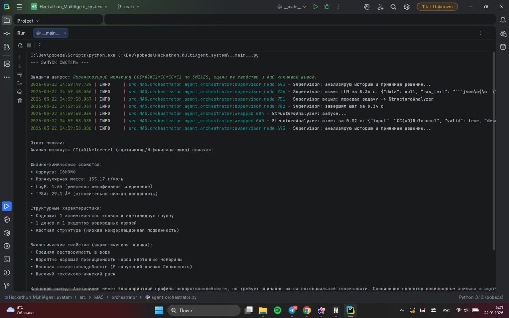
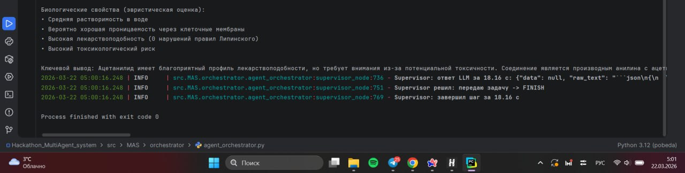

# Hackathon_MultiAgent_system
It-хакатон Сбер х Просто х Итмо мультиагентный ассистент химика-органика для планирования синтеза в лаборатории

cd Hackathon_MultiAgent_system
python -m venv .venv
source .venv/bin/activate
pip install -r requirements.txt
python __main__.py

export VSEGPT_API_KEY=sk-or-vv-
python testing/calculate_metrics.py \
  --gt testing/questions_gt.json \
  --model testing/questions_model_answers.json \
  --chatgpt testing/questions_chatgpt_answers.json

  
  